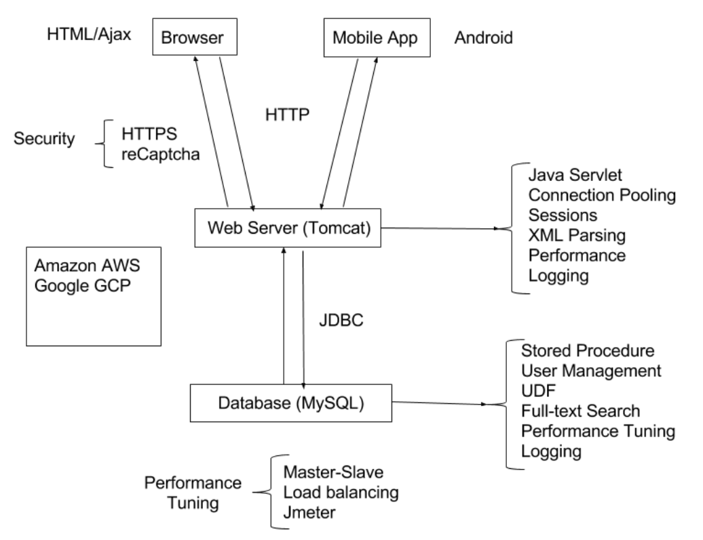

## Project overview

This project followed guidance from an UCI full-stack project class. Building a full-stack project that used micro-services architecture which contains web(html / CSS / JavaScript) and Android  front-end, that Share similar backend system, using MySQL as database. The project implements a movie E-commerce web application and it didn't use any framework for both backend and frontend.The project runs on both Amazon AWS and Google cloud servers at the end. All of work done by contributors is for learning purpose.

 

## About contributors

***Linda Shu:*** UCI computer science student

***Shaoyi Huang:*** UCI computer science student.

Since the original repository was deleted by the course instructor, there is no any record here shows the contribution. However, both front-end and back-end work divided equally to two contributors.

 

## Work progress tracking

### week1-2

- Created the moviedb that contains entries shown on graph

  

  The database is already designed by the course instructor.

  

- implement movie list

- implement single movie and single star page

 

### week 3-4

- add the Login page
  - checking the entered data through db
- add searching feature
  - substring search
- add browsing feature
  - by name
  - by genre
- create a main page
  - put searching and browsing feature on main page
- add sorting feature
  - sort by title
  - sort by rating
- add pagination feature
  - choose the "N" result shown the page
  - buttons to next / previous page
- add shopping cart feature
  - can add the movie to the shopping cart
  - store chosen movie into cookie
  - check the correctness of user input credit card info through database

 

### week 5-6 (security side of  the backend)

- Add google reCAPTCHA for checking robot
- Adding https
- Using prepared statement in database
- Update encrypted password in database
- Creating a dashboard managing the add/ delete movies star
  - using stored procedure to add
- Import large XML file into moviedb
  - data cleaning
  - using some better and fast ways to import

 

### week 7-8

- Adding full text search.
  - drop down menu contains some info of the movies
  - autocomplete
- Developing an Android side application that contains similar features as website.
- Adding fuzzy search.
  - using edit distance for fuzzy search

 

### week 9-10

- connection pooling 

- scaling with load balancer

  

  used three different instances (master/slave) to implement read and write.

- Using Jmeter measure the efficiency for different cases

  - Jmeter analysis: jmeter.html in web content
  - report: how we did the loadbalancer

 

## technical skill used in the project

- Tomcat servlet
- JDBC
- HTML
- CSS
- JavaScript

- micro-services architecture 
- reCapthca
- HTTPS
- data encryption
- XML parsing
- Android studio
- external API using
- UDF (user defined function in mySQL)
- mySQL connection pooling
- JMeter
- load balancer

## Project preview

 

## website

### user interface

Login page: requires correct  username-password pair

 

main page: contains the required element like search browse checkout etc.

 

movie page: search or browse result can be sort by different types

 

single movie page: after click movie title, get into the page contains more info

shopping cart page

checkout page: requires user to input info to checkout 

### dashboard

that can add movie or star directly to DB

 

feedbacks for add star and movie

 

## Android

